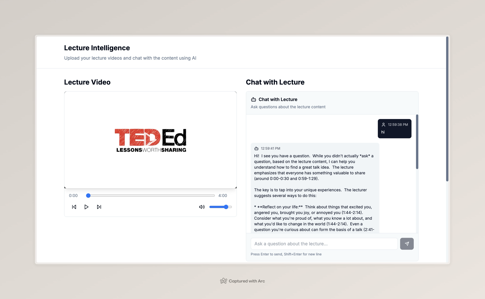

# 🎓 Lecture Intelligence

A smart AI-powered application that transforms your lecture videos into interactive, searchable knowledge. Upload your lectures, get instant transcripts, and chat with your content using natural language.

## 🚀 What This App Can Do

- **🎥 Video Processing**: Upload lecture videos (MP4, AVI, MOV, MKV, WebM) up to 2GB
- **📝 Smart Transcription**: Automatically generates timestamped transcripts using OpenAI Whisper
- **🧠 AI-Powered Chat**: Ask questions about your lectures and get intelligent answers with relevant timestamps
- **🔍 Content Search**: Find specific topics, concepts, or moments in your lectures instantly
- **⏰ Timestamp Navigation**: Jump directly to relevant parts of the video from chat responses
- **💾 Knowledge Storage**: All processed lectures are stored for future reference

## 🛠 How to Start

### 1. Clone & Setup
```bash
cd lecture
```

### 2. Install Dependencies
```bash
# Install FFmpeg (required for video processing)
brew install ffmpeg

# Backend setup
cd backend
python3 -m venv venv
source venv/bin/activate
pip install -r requirements.txt

# Frontend setup
cd ../frontend
npm install
```

### 3. Environment Variables
Create these files with your API keys:

**backend/.env**
```
GEMINI_API_KEY=your_gemini_api_key_here
```

**frontend/.env.local**
```
NEXT_PUBLIC_API_URL=http://localhost:8000
```

### 4. Start the Application
```bash
# From the root directory
./start.sh
```

Or start manually:
```bash
# Terminal 1: Backend
cd backend && source venv/bin/activate && python main.py

# Terminal 2: Frontend
cd frontend && npm run dev
```

### 5. Access the App
- Frontend: http://localhost:3000
- Backend API: http://localhost:8000

## 🔑 Get Your API Keys

**Gemini API Key (Required for AI chat)**
1. Go to [Google AI Studio](https://makersuite.google.com/app/apikey)
2. Create a new API key
3. Copy the key to your `backend/.env` file

## 🎯 How to Use

1. **Upload Video**: Drag & drop or select your lecture video
2. **Wait for Processing**: The app will extract audio, generate transcript, and process content
3. **Start Chatting**: Ask questions like:
   - "What did the professor say about machine learning?"
   - "Explain the concept discussed around minute 45"
   - "Summarize the key points from this lecture"
4. **Navigate**: Click on timestamps in responses to jump to specific video moments

## 📋 Tech Stack

- **Backend**: FastAPI, OpenAI Whisper, LangChain, ChromaDB, Gemini AI
- **Frontend**: Next.js, React, Tailwind CSS, TypeScript
- **Video Processing**: FFmpeg
- **AI & Search**: Vector embeddings, RAG (Retrieval-Augmented Generation)

## 🔧 Troubleshooting

**Video processing fails?**
- Make sure FFmpeg is installed: `brew install ffmpeg`

**Chat not working?**
- Check that your Gemini API key is correct in `backend/.env`
- Restart the backend server after adding the API key

**Frontend not loading?**
- Run `npm install` in the frontend directory
- Check that the backend is running on port 8000

